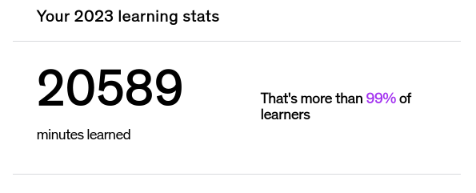
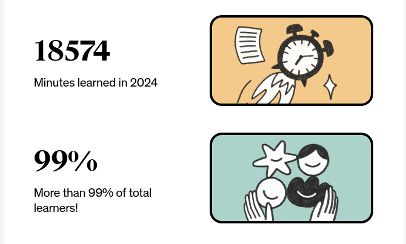

<!-- Todo: https://github.com/vn7n24fzkq/github-profile-summary-cards -->
<!-- https://github-profile-summary-cards.vercel.app/api/cards/profile-details?username=Michal-Radomski&theme=default
https://github-profile-summary-cards.vercel.app/api/cards/repos-per-language?username=Michal-Radomski=default -->
<!-- Todo: https://github.com/yoshi389111/github-profile-3d-contrib -->

<!-- # :fire: GitHub Languages and Stats -->

# 

            

       

<!-- ## :man_technologist: About Me -->

## 

- :wave: Hi, I’m @Michal-Radomski
- 👀 I’m interested in MERN/PERN stack
- :brain: I'm currently learning different JS libraries
- :milky_way: I like travelling, Ubuntu, Raspberry-Pi and astronomy :telescope:
- :spider_web: Portfolio: [https://michal-radomski.github.io](https://michal-radomski.github.io)
- :bulb: Gists: [https://gist.github.com/Michal-Radomski](https://gist.github.com/Michal-Radomski)
- :white_check_mark:
  [List of Completed Online Courses](https://github.com/Michal-Radomski/Michal-Radomski/tree/main/Certificates)

 

<!-- ## :hammer_and_wrench: Languages, Technologies and Tools -->

## 

<!--  -->
<!--  -->

  

    <!--  -->
    
    

 

  

  

  

  

 

<!-- Snake svg/gif -->

